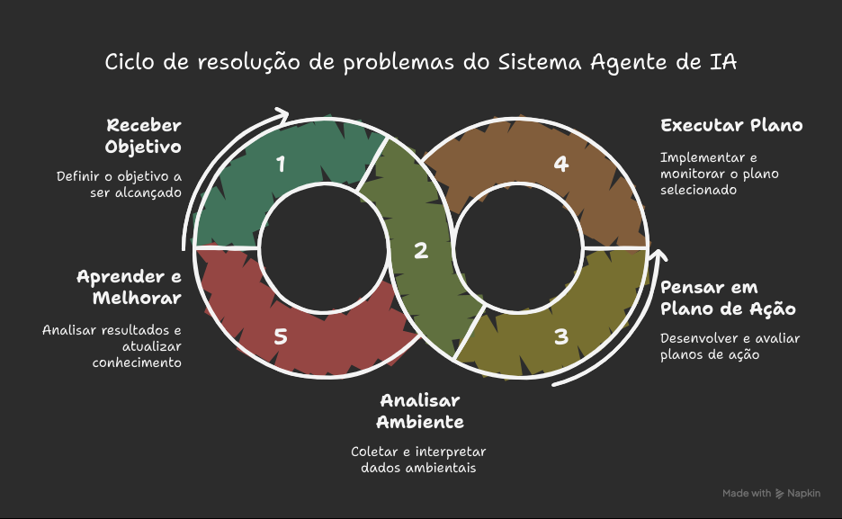

# O que faz de um Sistema de IA um "Agente"?

Podemos pensar em um *Agente de IA* como um sistema que tem a função de interpretar um determinado ambiente e realizar ações para atingir um objetivo específico. É uma evolução do que conhecemos atualmente do padrão de LLM (Grandes Modelos de Linguagem), melhorados com a capacidade de planejamento, utilização de ferramentas e interação com o ambiente ao seu redor.

***Abstração***: *Pense em um Agente de IA como um assistente inteligente, seguindo um conjunto de passos simples para conseguir realizar o trabalho e aprender ao longo do tempo.*

Imagine que esse assistente tem o objetivo de ***organizar a sua agenda***, ele então seguiria um fluxo com 5 etapas:

1. **Objetivo definido**: O objetivo do agente é organizar a sua agenda;
2. **Analisar o ambiente (contexto)**: Coleta as informações necessárias como emails, calendário, agenda e contatos, para entender o cenário;
3. **Pensar em um plano de ação**: Elaborra um plano de ação considerando os passos que devem ser tomados e tenta encontrar o melhor caminho pra executar a tarefa;
4. **Execução do plano**: Executa o plano enviando convites para os contatos, agendando eventos, organizando tarefas e datas;
5. **Aprender e melhorar**: Observa o trabalho executado, analisa os resultados positivos e se adapta para executar a tarefa de uma forma melhor da próxima vez, por exemplo, o assistente marcou um evento em uma data e horário que já havia algo marcado, na próxima vez, deve considerar os eventos já existentes na agenda, sem sobrepor uma atividade com outra.

Para entendermos melhor como agentes especializados podem trabalhar em conjunto para a execução de tarefas complexas, o autor discute ao decorrer do material, diferentes padrões de sistemas e paradigmas de colaboração e interação desses agentes, um para cada capítulo.

Vamos começar com exemplos de como esses padrões podem ser estruturados.
Para compreender melhor como agentes especializados podem atuar em conjunto na execução de tarefas complexas, o autor propõe ao longo de seu material diferentes padrões de sistemas, bem como paradigmas de colaboração e interação entre agentes — cada um explorado em um capítulo específico.

Vamos começar com exemplos de como esses padrões podem ser estruturados e aplicados na prática.

## Nível 0: O Núcleo de Raciocínio

Um LLM por si só não pode ser considerado um agente, mas ele serve como núcleo base de nosso sistema de agentes, nesse nível (0), o LLM opera sem ferramentas, memória ou interação com o ambiente, respondendo apenas ao seu conhecimento base, o qual foi treinado. A sua força está em alavancar o conhecimento que foi treinado para explicar conceitos já estabelecidos, tendo como *trade-off* a sua falta de percepção do ambiente (contexto) atual em que está sendo utilizado.

Se precisamos, por exemplo, de uma informação atualizada, como as *notícias das últimas* horas, ele é incapaz de fornecê-las, já que não foi treinado com essas informações.

## Nível 1: O Solucionador de Problemas Conectado

A esse nível, o LLM se torna um agente funcional, se conectando e utilizando ferramentas externas. Sua capacidade de resolução de problemas não é mais limitada pelo seu conhecimento, é capaz de executar uma sequencia de ações para coletar e processar informações de fontes como a internet (via *search*) ou bancos de dados (via *Retrieval Augmented Generation* - RAG).

Por exemplo, para encontrar novos programas de TV, o agente reconhece a necessidade de informações atualizadas, e utiliza a ferralemta de pesquisa para encontrar essas informações e sintetizar resultados. Pode até utilizar ferramentas especializadas para uma melhor acurácia, como a chamada de APIs para obter informações necessárias. Essa habilidade de interagir com o mundo exterior através de múltiplos passos é o núcleo da capacidade de um agente *Nível 1*.

## Nível 2: O Solucionador de Problemas Estratégico

No *Nível 2*, as capacidades de um agente se expandem significativamente, tendo planejamento estratégico, assistência proativa e auto-melhoria com engenharia de prompt e contexto como núcleo de suas habilidades.

Primeiro o agente vai além do uso de uma única ferramenta para abordar problemas complexos e com várias etapas utilizando estratégias de resolução de problemas, a medida que executa suas ações, ele ativamente performa a chamada *context engineering (engenharia de contexto)*.

Podemos definir a*engenharia de contexto* como um processo estratégico de seleção, empacotamenteo e gerenciamento das informações mais importantes para cada passo, imagine o seguinte cenário:

Para encontrar uma cafeteria em uma determinada área, primeiro utiliza uma ferramenta de mapeamento, ele sintetiza então o resultado desse mapeamento, criando um contexto curto e conciso, focado apenas nas informações importantes como por exemplo uma lista de endereços, então ele alimenta a ferramenta de pesquisa com essas informações, evitando uma sobrecarga cognitiva e garantindo que o segundo passo seja eficiente e preciso.

*Engenharia de Contexto* é então a disciplina que garante que esse processo de seleção e empacotamento das informações importantes aconteça de forma estratégica, é basicamente uma curadoria para a atenção limitada do modelo para garantir performance eficiente e de alta qualidade em qualquer tarefa que seja executada.

Esse nível leva à proatividade e operação contínua. Um assistente de email conectado ao seu email, por exemplo, demonstra essa proatividade através da engenharia de contexto de uma confirmação de um vôo, selecionando apenas os detalhes importantes (número de vôo, datas, locais, etc), empacota essas informações para ferramentas subsequentes utilizarem, marcando em uma agenda ou encaminhando as informações para alguém, por exemplo.

Em campos como a engenharia de software, o agente pode gerenciar fluxos de trabalho completos aplicando essa disciplina, quando solicitado feedback de como o prompt pode ser melhorado, está aprendendo como melhor curar inputs iniciais. Isso perimte que ele melhore automaticamente como faz o empacotamento das informações para tarefas futuras, criando um ciclo automatizado de feedback que melhora a eficácia e precisão ao longo do tempo.

Leia mais sobre [Engenharia de contexto](https://www.datacamp.com/pt/blog/context-engineering) pelo Datacamp.

## Nível 3: O Surgimento dos Sistemas Multiagentes Colaborativos
*(Em desenvolvimento)*